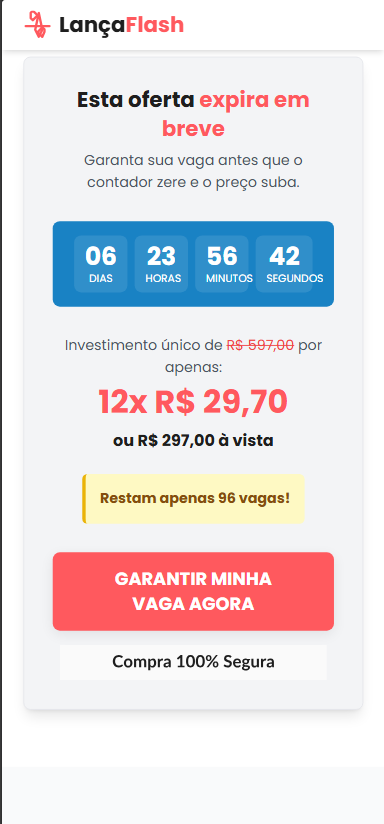

# LançaFlash – Landing Page

Landing page responsiva, **mobile-first**, construída com **Tailwind CSS** + **Alpine.js** para promover o curso _LançaFlash_.

## 📸 Preview

| Hero | Oferta |
|------|--------|
|  |  |

> As imagens acima são capturas da versão mobile (375 px).  
> Se preferir mantê-las em `assets/`, altere o caminho para `./assets/<nome>.png`.

---

## ✨ Destaques

- **Design mobile-first** (Breakpoints pensados para 100 % de responsividade)
- **Contagem regressiva** de 7 dias + estoque visual de vagas
- Boas práticas de **Acessibilidade** (foco visível, `aria-*`, contraste AA)
- Componentes prontos: Hero • Benefícios • Depoimentos • Oferta • Bônus • Garantia • FAQ • CTA final
- Otimizações de desempenho: imagens _lazy_, preload de fontes, CSS utilitário minificado
- **Zero build-step** – basta abrir `index.html` em qualquer navegador moderno

---

## 🚀 Como clonar e rodar localmente

```bash
# Clone o repositório
git clone https://github.com/naicolas-br/lancaflash-landing.git
cd lancaflash-landing

# Abra o arquivo HTML
# macOS
open index.html
# Windows
start index.html
# Linux
xdg-open index.html
